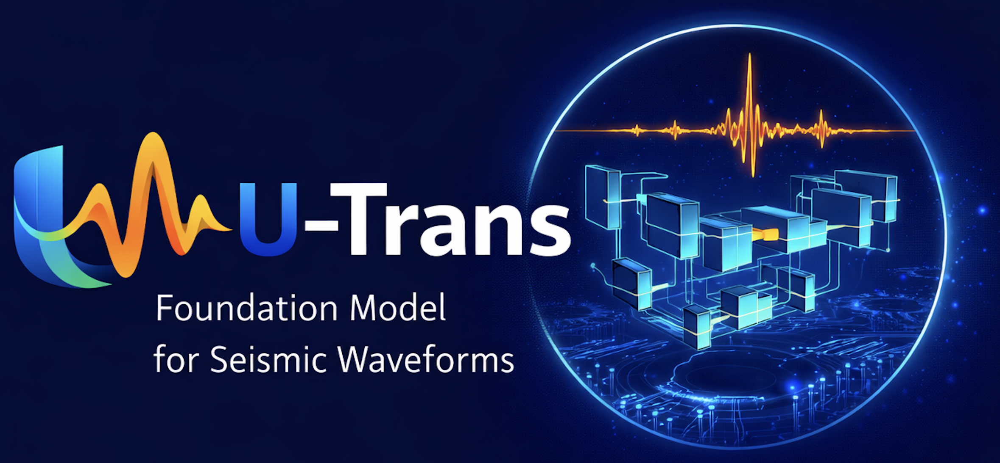

<p align="center">
  
</p>

# U-Trans  
## A Foundation Model for Seismic Waveform Representation

U-Trans is a **foundation model for seismic waveform representation** designed to learn transferable, structured embeddings from raw 3-component seismic waveforms.

This repository provides:

- ✅ U-Trans foundation backbone  
- ✅ Latent feature extraction  
- ✅ Modular downstream task architectures  
- ✅ Example usage notebooks  

---

# 🌍 Overview

U-Trans follows a **foundation model paradigm**:

1. Learn a strong, general seismic representation.
2. Expose reusable latent features.
3. Attach modular downstream models for task-specific learning.

The architecture separates:

```
Foundation representation  →  Latent features  →  Downstream models
```

---

# 🧠 Architecture

## 🔹 U-Trans Foundation Backbone

The foundation model consists of:

- U-Net encoder–decoder architecture  
- Transformer bottleneck representation  
- Multi-scale waveform feature extraction  
- Learned latent token embeddings  

---

### 📥 Input

```
(B, 6000, 3)
```

Where:

- `B` = batch size  
- `6000` = waveform length  
- `3` = three-component seismic signal  

---

### 🔹 Latent Representation

U-Trans produces:

```
(B, 75, 80)
```

- 75 latent tokens  
- 80-dimensional embedding per token  

These tokens encode structured waveform representations using transformer layers.

---

### 🔹 Decoder Feature Stream

The foundation model can also output:

```
(B, 6000, 1)
```

This stream can be directly concatenated with the input of the downstream task models.

---

# 🏗 Repository Structure

```
.
├── assets/
│   └── logo.png
│
├── examples/
│   ├── foundation_usage.ipynb
│   └── downstream/
│       ├── pwave_eqcct/
│       ├── swave_eqcct/
│       ├── magnitude_ViT/
│       ├── location_ConvMixer/
|       └── polarity_CCT/
│
├── utrans/
│   ├── foundation.py
│   ├── preprocessing.py
│   └── layers.py
│
├── weights/
│   └── UTrans_Foundation.h5
│
└── README.md
```

---

# 🔌 Downstream Architectures

Example downstream models are provided inside:

```
examples/downstream/
```

Available architectures include:

- `pwave_eqcct/` → Transformer-based P-wave picking EQCCT  
- `swave_eqcct/` → Transformer-based-S-wave picking EQCCT  
- `magnitude_ViT/` → Magnitude estimation ViT  
- `location_ConvMixer/` → Event location ConvMixer
- `polarity_CCT/` → Polarity classification CCT

Each downstream module attaches to the U-Trans latent or decoder representation.

---

# 🚀 Using the Foundation Model

You can load and extract features using:

```python
import os
import sys
import numpy as np

# ---------------------------------------------------------
# If notebook is inside examples/, add repo root to path
# ---------------------------------------------------------
sys.path.insert(0, os.path.abspath(".."))

from utrans.foundation import get_latent_model, get_decoder_model


# ---------------------------------------------------------
# Path to pretrained foundation weights
# ---------------------------------------------------------
UNET_WEIGHTS = "../weights/UTrans_Foundation.h5"


# ---------------------------------------------------------
# Model that outputs transformer latent tokens
# Expected output shape: (B, 75, 80)
# ---------------------------------------------------------
latent_model = get_latent_model(UNET_WEIGHTS)


# ---------------------------------------------------------
# Model that outputs decoder features
# ready_to_concatenate_model -> Keras model
# Featuear_Ready_to_Concatenate -> feature tensor shape
# Expected decoder feature shape: (B, 6000, 1)
# ---------------------------------------------------------
ready_to_concatenate_model, Featuear_Ready_to_Concatenate = get_decoder_model(UNET_WEIGHTS)
```

### Outputs

- Latent tokens → `(B, 75, 80)`  
- Decoder features → `(B, 6000, 1)`  

These outputs can be connected to any downstream model.

---

# 🔬 Design Philosophy

U-Trans is designed to:

- Learn general waveform representations  
- Enable modular downstream experimentation  
- Separate representation learning from task-specific modeling  
- Support transformer-based extensions  
- Scale to multiple seismic tasks  

---

# 📌 Key Characteristics

- U-Net multi-scale encoder  
- Transformer bottleneck modeling  
- Token-based latent embedding  
- Modular downstream integration  

---

# 📎 Citation

If you use this repository, please cite:

**U-Trans: a foundation model for seismic waveform representation and enhanced downstream earthquake tasks**  
DOI: 10.1038/s41598-026-41454-x

---

# 📧 Contact

For questions or collaboration, please open an issue in this repository.

---


